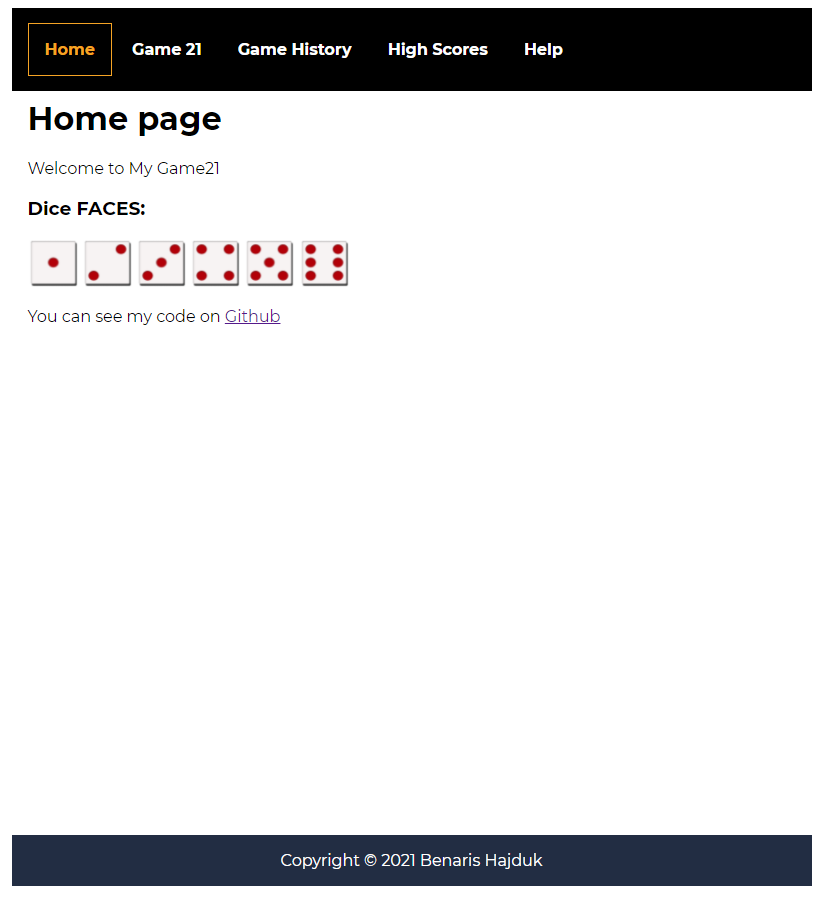
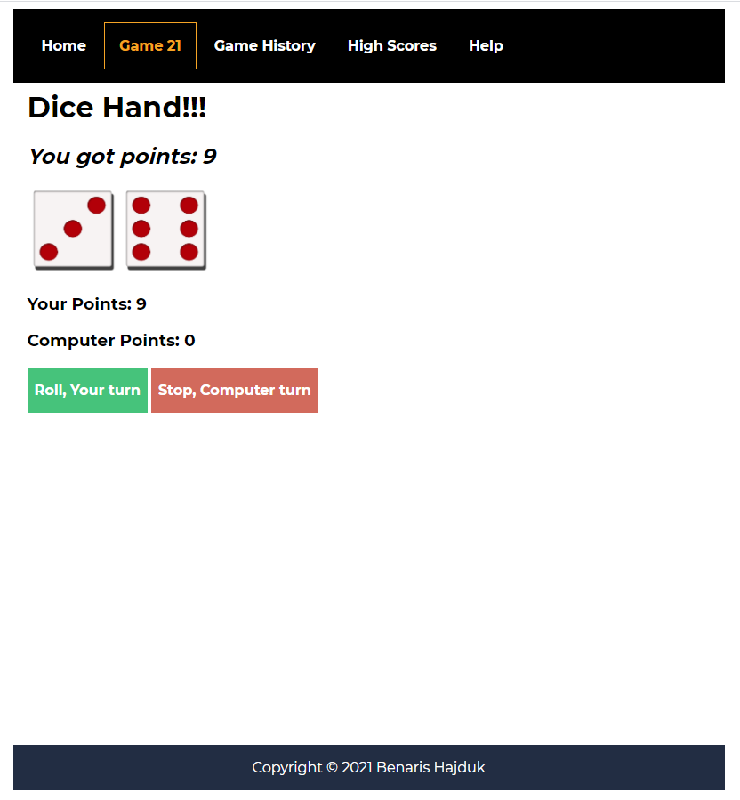
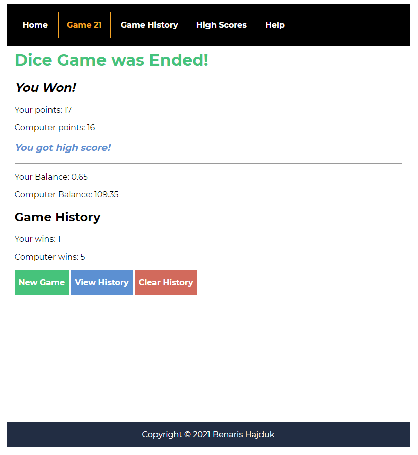
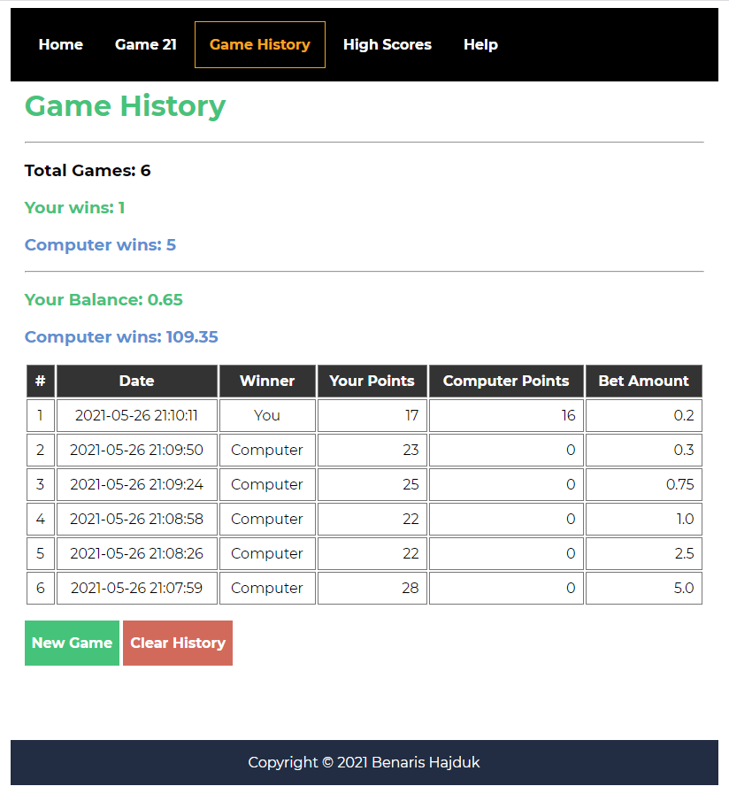
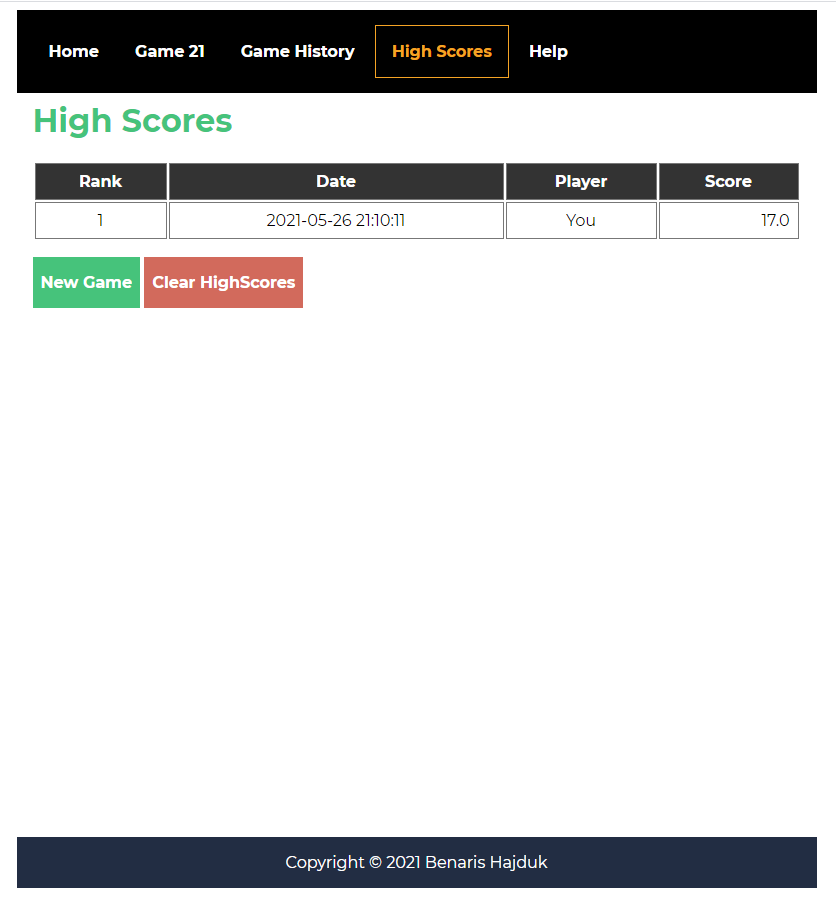

# Game21 Project
===============================

##### Travis CI

##### Scrutinizer CI

This project is a simple dice game built by Laravel v8 MVC Framework.

You can play 21 against the computer with betting.

This game will use Sqlite database for saving highscore and history.

This project contains the game flow chart and some psuedo codes. (/doc)

Installation
-------------------------------

You can clone this repo or download zip from github.

git clone [repository link]

composer install

npm install

Feel free to configure your .env

How to play
-------------------------------

You can hit [Game21] in menu and play this game.

You can see the game high scores and history.

Please review [Help] for game rules.

